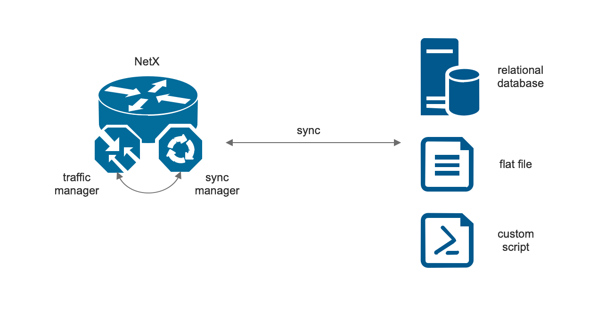
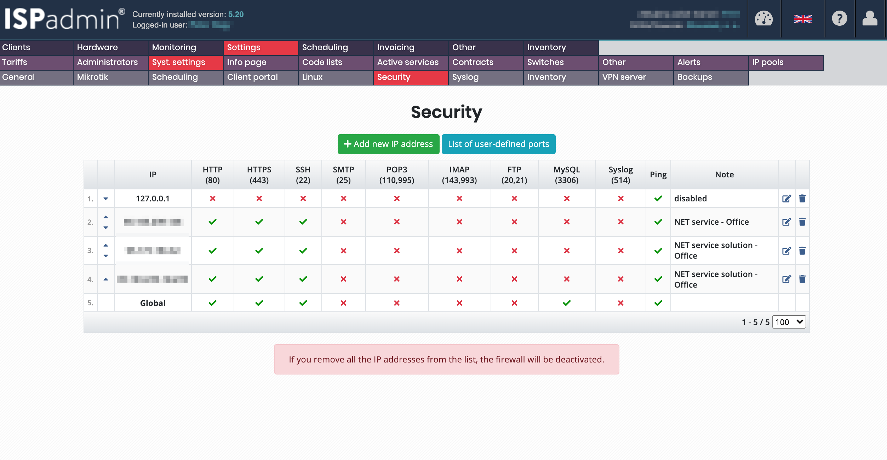
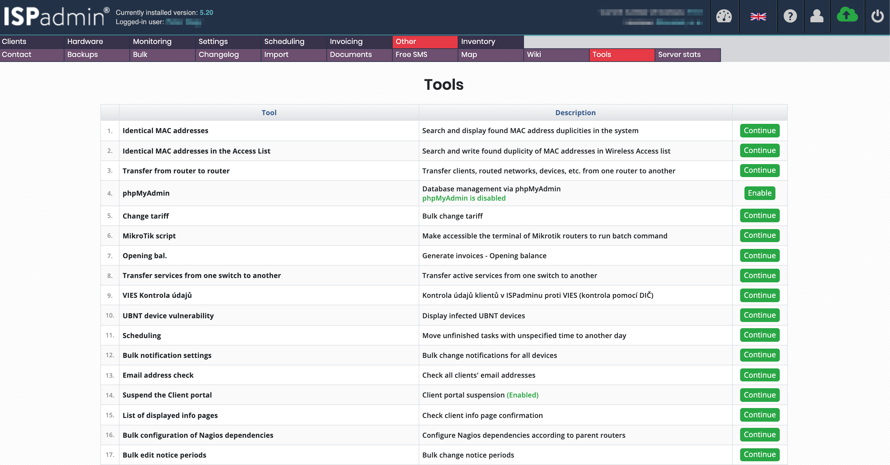

# Sync manager

The synchronisation manager handles integration between NetX and third-party management softwares such as
[ISPadmin](https://ispadmin.eu/), [Mango](https://www.ogsoft.cz/produkty-a-sluzby/pro-firmy/mango), 
[Adminus](https://www.adminus.cz/) or a custom server database. It is possible to use flat files or custom scripts
as well. The following picture shows the sync manager handling the communication with an external data source,
doing data preprocessing and storing the data to the NetX internal database. Traffic manager then uses the local
copy of the metadata and orchestrate the NetX platform accordingly.




### Context

It is possible to switch to the sync-manager context using `sync-manager` command.

```
netx# sync-manager
netx(sync-mgr)# <command>
```

### Commands

The following commands are available in the sync-manager context.

#### enable

Enable sync-manager engine.

##### Syntax

`enable`

##### Default value

sync-manager is disabled by default.

---

#### edit

Edit a custom database query file set using [db-qos-query](sync-manager.md#db-qos-query) command.
After saving the file, the query is reloaded.

##### Syntax

`edit`

---

#### db-driver

Set a database driver used for connection. The following drivers are supported:

* mysql : MySQL server or compatible (e.g. MariaDB)
* pgsql : PostgreSQL server
* sqlite : SQLite server
* mssql : Microsoft Driver 13 for SQL Server

##### Syntax

`db-driver <driver>`

##### Example

```
db-driver mysql
```

---

#### data-source

Data source for sync-manager. The following sources are supported.

* adminus : [Aminus CRM](https://www.adminus.cz/)
* ispadmin : [ISPadmin](https://ispadmin.eu/)
* mango : [Mango](https://www.ogsoft.cz/produkty-a-sluzby/pro-firmy/mango)
* sql : A custom, SQL server. See [custom SQL server integration](sync-manager.md#custom-sql-server-integration) for further details.

##### Syntax

`data-source <source>`

##### Example

```
data-source sql
```

---

#### db-host

Set a hostname or an IP address of a database server. 

##### Syntax

`db-host <str>`

##### Example

```
db-host mydb.example.com
```

---

#### db-username

Username for accessing the [database](sync-manager.md#db-name).

##### Syntax

`db-username <str>`

##### Example

```
db-username testuser
```

---

#### db-password

[User's](sync-manager.md#db-username) password for accessing the [database](sync-manager.md#db-name)

##### Syntax

##### Example

---

#### db-name

Name of the database to use. Usually required with a custom SQL server. ISPadmin, Adminus, Mango don't need this option.

##### Syntax

`db-name <str>``

##### Example

```
db-name testdb
```

---

#### db-qos-query

Set's a SQL query file. If the file doesn't exist, the file is created in `/etc/netc/sql/` directory.
The SQL query can be edited using the [edit](sync-manager.md#edit) command in sync-manager context.

##### Syntax

`db-qos-query <filename>`

##### Example

```
netx# sync-manager
netx(sync-mgr)# db-qos-query sync.sql
No config file found. Building an initial config file in /etc/netc/sql/sync.sql
```

---

#### db-scan-interval

How often is the database queried. 

##### Syntax

`db-scan-interval <seconds>`

##### Default value

300 seconds

##### Example

Sync every 3 minutes.

```
db-scan-interval 180
```

---

## ISPadmin integration

Integration with ISPadmin CRM requires some additional steps in ISPadmin.

1. Open MySQL port for NetX IP address. Navigate to Settings->System settings->Security->Add IP address and allow
MySQL port as seen in the following figure.



2. Create a MySQL user for the ISPadmin database (write permission is required for `sl_internet` table). The easiest way
how to do that is enable phpMyAdmin in ISPadmin settings (Other->Tools) -- see the following picture.
 


You can find login credentials to the ISPadmin database in `/data/support/ispadmin/new/app/config/database.neon` config
at your local ISPadmin deployment.

3. After the MySQL port is enabled in ISPadmin and the user with necessary permission is created, you can configure sync-manager
in NetX. The configuration is straighforward as seen in the following example:

```
netx# sync-manager 
netx(sync-mgr)# data-source ispadmin
netx(sync-mgr)# db-host 10.100.103.3
netx(sync-mgr)# db-password example-password
netx(sync-mgr)# db-username netx
netx(sync-mgr)# enable
```

4. You can verify the settings using `show sync-manager` command.

```
netx1-blansko# show sync-manager 
Data source                   : ispadmin
DB Host Name                  : 10.100.103.3
DB User Name                  : netx
DB Password                   : example-password
DB scan interval (secs)       : 300
Query Error Status            : OK
Query Execution Time (secs)   : 8.03777289390564
Query Returned Records        : 4252
Last updated                  : 2022-01-07 15:37:50 (12.50 secs ago)
Sync manager status           : IDLE

```


## Custom SQL server integration

It is possible to integrate sync-manager with a custom SQL server. sync-manager will query the SQL server and the server
should return the following fields. The order of the fields must be preserved! 

```
ipaddr, grp, download, upload, mark, parent, options
```

> [!IMPORTANT]
> The order of the fields must be preserved! 

The meaning of the columns is the following:
* `ipaddr` : IPv4 or IPv6 address in text format. IP address can be extended with a mask length (IP prefix). If the prefix syntax is
used, the shaping rule is applied for the whole prefix. Examples of the values in the column: `192.0.2.2`, `192.0.2.16/28`, 
`2001:db8:1220::/48`. The `NULL` value is allowed only if the column `grp` is defined.
* `grp` : A unique group for every shaping rule. Groups can be used in the hierarchical shaping or can merge multiple shaping rules 
(for example IPv4 and IPv6 prefixes) into a one shaping queue. `NULL` value is allowed. If the `NULL` value is set, the group is 
internally created based on the `ipaddr` column.
* `download` : Allowed bandwidth in bits per second (Example: 10000000 = 10Mb/s)
* `upload` : The same as `download` but for the upload direction.
* `mark` :  Every packet entering into NetX router can be marked by a value. This mark can be later used in firewall rules, etc. `NULL` 
value is transformed to 0.
* `parent` : Name of the superior group. This column is used when hierarchical traffic shaping is required.
 
### Rules examples

The previous section shows fields that can synchronized with sync-manager. This section shows basic examples how to use all those fields.

* Shaping an address: The following record achieves that IP address 192.0.2.5 is allowed to download 10 Mb/s. Upload speed is set 
to 5 Mb/s. No marking or hieararchical shaping is used.

```
IP                        GRP     DOWNLOAD  UPLOAD   MARK  PARENT
192.0.2.5                 NULL    10000000  5000000  NULL  NULL
```

* Shaping a prefix: It's possible to shape a whole prefix (either IPv4 or IPv6). E.g.

```
IP                        GRP     DOWNLOAD  UPLOAD   MARK  PARENT
2001:db8:1220:a::/64      NULL    10000000  5000000  NULL  NULL
```

* Shaping IPv4 + IPv6: If dual stacked is provided to a client, it's possible to shape the client regardless of a protocol. Group column is used for 
grouping all IP addresses (IPv4 or IPv6) to one group. In the following example, two groups (`user1` and `user2`) are created. All IP addresses in the
particular group will have togeteher 10 Mb/s download and 5 Mb/s upload regardless of the protocol.

```
IP                        GRP     DOWNLOAD  UPLOAD   MARK  PARENT
192.0.2.5                 user1   10000000  5000000  NULL  NULL
2001:67c:1220:a::/64      user1   10000000  5000000  NULL  NULL
192.0.2.6                 user2   10000000  5000000  NULL  NULL
2001:67c:1220:b::/64      user2   10000000  5000000  NULL  NULL
```

### Custom SQL server Example

In the following example, sync manager is connected to a custom MySQL server to download all shaping rules. Let's assume that
the database server uses very simple database with just IP address and upload/download speed the IP address is allowed to use.


```
--
-- Table structure for table `shaping`
--
CREATE TABLE shaping (
  id int(11) NOT NULL AUTO_INCREMENT,
  ipaddress varchar(128) NOT NULL,
  download int(11) NOT NULL,
  upload int(11) NOT NULL,
  PRIMARY KEY (`id`)
);

--
-- Insert an example customer, that uses IP address 192.0.2.1 and should be shaped to 10/10 Mb/s
--

INSERT INTO shaping (ipaddress, download, upload) VALUES ('192.0.2.1', 10000000, 10000000);
```

* Let's set basic settings, such as database server and login/password credentials to connect to the netx database created on
the server.
 
```
netx# sync-manager 
netx(sync-mgr)# data-source sql
netx(sync-mgr)# db-driver mysql
netx(sync-mgr)# db-host 10.100.100.1
netx(sync-mgr)# db-password example-passwd 
netx(sync-mgr)# db-username netx
netx(sync-mgr)# db-name netx
netx(sync-mgr)# db-qos-query shaping.sql
No config file found. Building an initial config file in /etc/netc/sql/shaping.sql
```

* As the next step, it's necessary to edit the SQL query to properly return the required fields. The edit command
runs an editor where it's possible to modify the query. The file already has an example query commented out.

```
netx(sync-mgr)# edit
--
-- Example of QoS query
--
-- SELECT
--   ipaddr, grp, download, upload, mark, parent, options
-- FROM
--  shaping
-- WHERE
--   active = 1
--
-- For further documentation see https://docs.netx.as
```

* Let's modify the query according the simple database requirements. The final query can look like the following example. Notice
that we need to return columns in the same order. That's the reason why the query must return `NULL` value in the second field as
`grp` doesn't exist in the database. 

```
SELECT ipaddress, NULL, download, upload from shaping;
```

* After the query is saved, it's possible to check the result using the `show sync-manager` command.

```
netx# show sync-manager 
Data source                   : sql
DB Driver Name                : mysql
DB Name                       : netx
DB scan interval (secs)       : 300
Query Error Status            : OK
Query Execution Time (secs)   : 0.0122449398040771
Query Returned Records        : 1
Last updated                  : 2022-01-06 09:06:36 (69.26 secs ago)
Sync manager status           : IDLE
```

* If traffic-manager is configured, it's possible to display the rules:

```
netx# show traffic-manager qos-rules         
GROUP                         DOWNLOAD                    UPLOAD           COMMENT
                       b/s (cfg)   b/s (act)      p/s (cfg)   b/s (act)
192.0.2.1                  10.0M       0.0           10.0M       0.0                           

```
