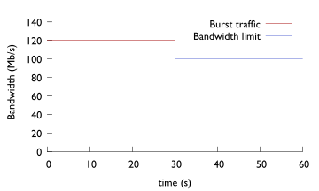

# QoS

Quality of Service (QoS) controls network traffic and allows a service provider to meet the level of service required by a customer.
QoS reduces packet loss, provides dedicated bandwidth for users or services and implements congestion management.

NetX platform offers comprehensive set of functions for managing QoS rules, perform traffic shaping using several advanced algorithms,
policing or marking for every single user. The traffic for each user is defined by rules that can be organised into a hierarchical
structure. There can be several parameters such as priority, bursts and other options defined for each rule. For more sophisticated
traffic shaping strategy, adaptive shaping can be defined.

## Traffic manager

The main NetX service responsible for managing QoS rules is the traffic manager. The traffic manager has two major roles:

1. Takes care about loading and setting shaping rules and orchestrate NetX platform to perform the necessary action.
2. Marks packets passing through NetX router. Every packet can be marked with a tag. The mark tag can be referenced later in firewall,
   traffic redirection or used during routing decisions.

Traffic manager is designed to handle tens of thousands of records. It is possible to create separate shaping queues with own shaping
parameters, organize shaping queues into hierarchical structure and much more.

### Context

It is possible to switch to the traffic manager context using `traffic-manager` command.

```
netx# traffic-manager
netx(traff-mgr)# <command>
```

### Commands

The following commands are available in traffic-manager context.

#### enable

Enable traffic manager engine.

##### Syntax

`enable`

##### Default value

traffic manager is disabled by default.

---

#### interface

Interface that traffic-manager works on. Multiple interfaces can be specified. If no interface is configured the traffic manager
does not install any rules.

##### Syntax

`interface <interface-name>`

##### Default value

No interface is set.

##### Example

The following example configures traffic-manager to work on bond0 and bond1 interfaces.

```
netx# traffic-manager
netx(traff-mgr)# interface bond0
netx(traff-mgr)# interface bond1
```

---

#### db-qos-min-records

The minimum number of QoS records that must be retrieved by a QoS query. If the number of retrieved records is lower than
the set value, the query is ignored and `min records limit reached` is shown in query status. QoS rules that are in effect on
an interface are not affected.

##### Syntax

`db-qos-min-records <int>`

##### Default value

Not set.

---

#### force-update

`force-update` refresh and reinstall the QoS rules on an interface configured with [interface](traffic-shaping.md#interface) command.

##### Syntax

`force-update`

---

## Configuring QoS rules

QoS rules are configured in traffic-manager context. The rules don’t have to be configured if sync-manager takes care of rules
synchronization with a third party database.

### Context

`qos-rules` command has own subcontext. It is possible to switch to the subcontext using the following command.

```
netx# traffic-manager qos-rules
netx(traff-mgr-rules)#
```

The main comnand for setting a QoS rule and various rule options is `action shape` command in `qos-rules` subcontext.

#### action shape

The main command for configuring QoS rules. Contains several options for detailed setting of a QoS rule.

##### Syntax

`action shape <opts>`

##### Example

See the following [QoS rule options](traffic-shaping.md#qos-rule-options) for further information.

---

### QoS rule options


#### group

A group name that identifies the node.

##### Syntax

`group <string>`

##### Default value

If group name is not provided, the value is derived from `prefix` as `grp-<prefix>`

##### Example

`group node1`

---

#### prefix

IP prefix that the shaping rule is applied on. `x.x.x.x/x` for IPv4, `XX:XX::X/X` for IPv6. Mask length can be omitted if only one
host should be selected.

##### Syntax

`prefix <IPv4Prefix>|<IPv6Prefix>`

##### Example

```
prefix 100.64.10.0/24
prefix 2001:db8:85a3::/64
prefix 100.64.10.10
prefix 2001:db8:85a3::10
```

---

#### download

Base download speed in b/s. It's possible to use standard prefix `k`, `M`, `G` and use a human readable numbers.

##### Syntax

`download <num>[<.num>]<suffix>`

##### Example

* limit download speed to 5.5 Mb/s

```
download 5.5M
```

* limit download speed to 100 Mb/s

```
download 100M
```

---

#### upload

Base upload speed in b/s. See [download](traffic-shaping.md#download) for details.

##### Syntax

`upload<num>[<.num>]<suffix>`

---

#### parent

A parent node if QoS rules are organized in a [hierarchical](traffic-shaping.md#hierarchical-shaping) structure.

##### Syntax

`parent <string>`

##### Example

```
parent line1
```

---

#### mark

Internal mark sets on packets for an IP address or prefix. The mark is encoded in 8 bits, where the top 4 bits are used if
the prefix is identified as the source of the traffic, and the bottom 4 bits are set if the prefix is identified as the destination.

##### Syntax

`mark <0-15>`

##### Example

```
mark 10
```

By setting `mark 10`, it is possible to use firewall with `mark 0xA0/0xF0` to match packets where IP address or a prefix is
originator of the traffic. The `mark 0xA/0xF` can be used in firewall to match packets where IP address or a prefix is the destination.

---

#### priority

Priority of a QoS rule if hierarchical shaping is used. See [Shaping Priorities]() for further information.

##### Syntax

`priority  <number>[/<number-up>]`

* `<number>` - priority for download bandwidth or both download and upload bandwidth if `<number-up>` is not defined.
* `<number-up>` - priority for upload bandwidth (if different priority is required for download and upload)

##### Default value

Default priority value is `100`.

##### Example

* Sets priority to 90 for both download and upload

```
priority 90
```

* Sets priority to 300 for download and 50 for upload.

```
priority 300/50
```

---

#### burst

Amount of additional bandwidth that is added to the base bandwidth at the beginning of download/upload.
See [Queue Burst](traffic-shaping.md#queue-burst) for further information.

##### Syntax

`burst <percent>[,<time>][/<percent-up>[,<time-up>]]`

* `percent` - increase the download bandwidth by the amount of `<percent>` for <time> period (in seconds). Increase both download and upload if `<percent-up> is not defined.
* `time` - time interval in seconds
* `percent-up` - increase the upload bandwidth for the amount of `percent`

If negative value is used, the amount of bandwidth is decreased.

##### Default value

* `percent` : 0 (burst is disabled)
* `time` : 10

##### Example

* Add 20% of bandwidth for 10 seconds (both upload and download)

```
burst 20
```

* Add 20% of bandwidth for 30 seconds (both upload and download)

```
burst 20,30
```

* Add 20% of download bandwidth for 30 seconds and add 30% of upload bandwidth for 40 seconds

```
burst 20,30/30,40
```

* Decrease initial bandwidth by 20% for 15 seconds (both upload and download)

```
burst -20,15
```

---

#### adaptive

Adaptive shaping can be used to update the QoS rule in realtime based on the rule utilization. This can help to limit
subscribers that transmit permanently huge portions of data. NetX makes internal statistics of each shaping group
every minute, these statistics are used to apply adaptive shaping. See [Adaptive shaping]() for further information.

##### Syntax

`adaptive <steps>[,<min-bw>[,<threshold>[,<algo>]]][/<steps-up>[,<min-bw-up>[,<threshold-up>[,<algo-up>]]]]`

* `steps` - number of steps in adaptive shaping
* `min-bw` - minimal download/upload bandwidth as percentage of the main bandwidth
* `threshold` - percentage of the main bandwidth to activate adaptive shaping
* `algo` - algorithm to use (linear, log, exp)

##### Example

```
adaptive 60,20,50
adaptive 60,20,50,linear
```

See [Adaptive shaping]() for further information.

---

#### halfduplex

Sets half duplex shaping - both download and upload traffic is directed to the same queue.

##### Syntax

`halfduplex`

##### Default value

halfduplex is not set

---

#### comment

Each rule can have a string comment for easier maintaining and troubleshooting. If empty spaces are
required, the comment should be enclosed in quotation marks.

##### Syntax

`comment <string>`

##### Example

```
comment "user comment"
```

---

#### ecn

In case of congestion, marks packets with ECN ([Explicit Congestion Notification](https://datatracker.ietf.org/doc/html/rfc3168))
bit instead of dropping them. Works with codel, fq_codel and sfq as queuing discipline.

##### Syntax

`ecn`

##### Default value

Marking packets with ECN is disabled by default.

---

#### queuelimit

Limit queue size. When this limit is reached, incoming packets are dropped.
If the value is lowered, packets are dropped so that the new limit is met.
Works with codel, fq_codel and sfq as queuing discipline.

##### Syntax

`queuelimit <number>`

##### Default value

Default is 1000 packets.

##### Example

```
queuelimit 10000
```

---

## Hierarchical shaping

QoS shaping rules can be organized in a hierarchical structure. Nodes in the structure are connected together
via [group](traffic-shaping.md#group) name and [parent](traffic-shaping.md#parent). The
structure typically follows a physical topology of a network. The following figure shows a simple network
topology with four lines (line1, line2, line21 and line22) and several hosts using these lines. Each
line has a bandwidth limit and each client has a contract with an individual speed limit.


The topology can be implemented with the following commands in netc CLI.

```
netx# traffic-manager qos-rules
netx(traff-mgr-rules)#
netx(traff-mgr-rules)# shape group line1 download 100M upload 100M
netx(traff-mgr-rules)# shape prefix 100.64.1.1 download 100M upload 100M parent line1
netx(traff-mgr-rules)# shape prefix 100.64.1.2 download 100M upload 100M parent line1
netx(traff-mgr-rules)# shape group line2 download 90M upload 30M
netx(traff-mgr-rules)# shape group line21 download 70M upload 25M parent line2
netx(traff-mgr-rules)# shape prefix 100.64.2.1 download 50M upload 20M parent line21
netx(traff-mgr-rules)# shape prefix 100.64.2.2 download 50M upload 20M parent line21
netx(traff-mgr-rules)# shape group line22 download 50M upload 20M parent line2
netx(traff-mgr-rules)# shape prefix 100.64.3.1 download 50M upload 20M parent line22
netx(traff-mgr-rules)# shape prefix 100.64.3.2 download 20M upload 10M parent line22
```

### Traffic distribution

The traffic is distributed equally amongst all subnodes in the default configuration. Let’s
consider the following hierarchy to show some examples of traffic distribution between nodes
(to make things easier we discuss only the download direction, but the upload direction works the same way).

<p align="center">

</p>

The nodes have the following config speeds:

```
N1: download 2000Mb/s
	N1.1: download 400Mb/s
	N1.2: download 200Mb/s
	N1.3: download 200Mb/s
	N1.4: download 200Mb/s
	N1.5: download 200Mb/s
```

There are four nodes (N1.2 - N1.5) with configured download speed 200Mb/s and one node (N1.1)
that is configured with download speed 400Mb/s. All these nodes are connected to the parent
node (N1) which has configured bandwidth 2000 Mb/s. Let’s discuss several different scenarios
how nodes request bandwidth and how bandwidth is allocated between nodes.

* Let's say that all nodes N1.1 - N1.5 request maximum capacity. In this case, all nodes will
be satisfied completely as the parent node (N1) has configured enough bandwidth to do that.

```
N1: download 2000Mb/s, requests 1200Mb/s, gets 1200Mb/s
	N1.1: download 400Mb/s, requests maximum, gets 400Mb/s
	N1.2: download 200Mb/s, requests maximum, gets 200Mb/s
	N1.3: download 200Mb/s, requests maximum, gets 200Mb/s
	N1.4: download 200Mb/s, requests maximum, gets 200Mb/s
	N1.5: download 200Mb/s, requests maximum, gets 200Mb/s
```

* Different situation happens if the parent node (N1) doesn’t have enough bandwidth. Let's slightly
change the previous example and limit the parent node N1 with only 500Mb/s bandwidth. In such case,
the traffic is distributed equally amongst all nodes.

```
N1: download 500Mb/s, requests maximum, gets 500Mb/s
	N1.1: download 400Mb/s, requests maximum, gets 100Mb/s
	N1.2: download 200Mb/s, requests maximum, gets 100Mb/s
	N1.3: download 200Mb/s, requests maximum, gets 100Mb/s
	N1.4: download 200Mb/s, requests maximum, gets 100Mb/s
	N1.5: download 200Mb/s, requests maximum, gets 100Mb/s
```

In case that a node does not request full bandwidth, the remaining traffic is distributed to other
nodes. There are several examples of traffic distribution amongst nodes.

* Node N1.1 requests 300 Mb/s and node N1.2 requests 200 Mb/s. These requests can be satisfied by the
parent node, thus these requests are fulfiled.

```
N1: download 500Mb/s, requests 500Mb/s, gets 500Mb/s
	N1.1: download 400Mb/s, requests 300Mb/s, gets 300Mb/s
	N1.2: download 200Mb/s, requests 200Mb/s, gets 200Mb/s
	N1.3: download 200Mb/s, requests   0Mb/s, gets   0Mb/s
	N1.4: download 200Mb/s, requests   0Mb/s, gets   0Mb/s
	N1.5: download 200Mb/s, requests   0Mb/s, gets   0Mb/s
```

* Nodes N1.1, N1.2, N1.3 request capacity that exceeds the parent limitation, thus, the bandwidth
is redistributed between requesting nodes.

```
N1: download 500Mb/s, requests maximum, gets 500Mb/s
	N1.1: download 400Mb/s, requests 300Mb/s, gets 166Mb/s
	N1.2: download 200Mb/s, requests 200Mb/s, gets 166Mb/s
	N1.3: download 200Mb/s, requests 200Mb/s, gets 166Mb/s
	N1.4: download 200Mb/s, requests   0Mb/s, gets   0Mb/s
	N1.5: download 200Mb/s, requests   0Mb/s, gets   0Mb/s
```

* The following example shows different case of traffic distribution if sum of all requests exceeds
the parent limitation.

```
N1: download 500Mb/s, requests maximum, gets 500Mb/s
	N1.1: download 400Mb/s, requests 300Mb/s, gets 290Mb/s
	N1.2: download 200Mb/s, requests 200Mb/s, gets 200Mb/s
	N1.3: download 200Mb/s, requests  10Mb/s, gets  10Mb/s
	N1.4: download 200Mb/s, requests   0Mb/s, gets   0Mb/s
	N1.5: download 200Mb/s, requests   0Mb/s, gets   0Mb/s
```

* If there are several nodes requesting bandwidth, the bandwidth is distributed between nodes as shown
in previous examples. In the following example, the nodes N1.3, N1.4 and N1.5 request 20Mb/s. As the theoretical limit
for a node is 100Mb/s, these requests are fulfilled and the remaining traffic is distributed to nodes
N1.2 and N1.1.

```
N1: download 500Mb/s, requests maximum, gets 500Mb/s
	N1.1: download 400Mb/s, requests maximum, gets 240Mb/s
	N1.2: download 200Mb/s, requests maximum, gets 200Mb/s
	N1.3: download  20Mb/s, requests maximum, gets  20Mb/s
	N1.4: download  20Mb/s, requests maximum, gets  20Mb/s
	N1.5: download  20Mb/s, requests maximum, gets  20Mb/s
```

* Let's consider slightly different scenario. If there are 200 nodes. N1.1 node is configured with download
bandwidth 400 Mb/s, the rest 199 nodes are configured with 10 Mb/s. If all nodes requests their maximum
capacity, it can lead to the starvation of N1.1 node.

```
N1: download 500Mb/s, requests maximum, gets 500Mb/s
	N1.1: download  400Mb/s, requests maximum, gets 2.5Mb/s
	N1.2: download   10Mb/s, requests maximum, gets 2.5Mb/s
	N1.3: download   10Mb/s, requests maximum, gets 2.5Mb/s
	... another 197 nodes configured with 10Mb/s
	N1.200: download 10Mb/s, requests maximum, gets 2.5Mb/s
```

The last example shows that large number of nodes configured with small bandwidth can starve the node N1.1. Such situation can be prevented
by setting [node priority](traffic-shaping.md#shaping-priorities).

### Shaping Priorities

All nodes have the same [priority](traffic-shaping.md#priority) set to 100 by default. Priority defines
the **ratio** of the traffic that should be delivered in shaping hierarchy to a particular subnode. Let's
consider the following scenarios.

* There is a parent node configured with 500 Mb/s bandwidth and two subnodes configured each with 400 Mb/s.
If no priority is set and nodes request maximum of their capacity, each node receives 250 Mb/s. However,
if we set a shaping priority, we can achieve different bandwidth ratio. Consider the following example:

```
N1: download 500Mb/s, requests maximum, gets 500Mb/s
	N1.1: download 400Mb/s, priority 2, requests maximum, gets 200Mb/s
	N1.2: download 400Mb/s, priority 3, requests maximum, gets 300Mb/s
```

N1.1 node is configured with priority 2 and node N1.2 with priority 3. In this scenario, priorities are
configured in `2/3` ratio, thus N1.1 receives 200 Mb/s, and N1.2 receives 300 Mb/s.

> [!NOTE]
> The priority sets the ratio of the traffic. Thus, the same result can be achieved by setting N1.1 with priority 200
> and N1.2 with priority 300 as the ratio is still the same (2/3). We can achieve also the same result with setting only
> N1.2 with priority 150. The N1.1 has the default priority 100, thus, the ratio is still 2/3.


* The following configuration sets different priorities for nodes N1.1, N1.2, N1.3. The ratio is 1:2:3, thus, the
N1.1 receives 83 Mb/s, N1.2 receives 167 Mb/s and N1.3 250 Mb/s.

```
N1: download 500Mb/s, requests maximum, gets 500Mb/s
	N1.1: download 400Mb/s, priority 1, requests maximum, gets  83Mb/s
	N1.2: download 400Mb/s, priority 2, requests maximum, gets 167Mb/s
	N1.2: download 400Mb/s, priority 3, requests maximum, gets 250Mb/s
```

* The same configuration can be achieved by setting priorities to 100, 200 and 300, as the ratio is still the same.

```
N1: download 500Mb/s, requests maximum, gets 500Mb/s
	N1.1: download 400Mb/s, priority 100, requests maximum, gets  83Mb/s
	N1.2: download 400Mb/s, priority 200, requests maximum, gets 167Mb/s
	N1.2: download 400Mb/s, priority 300, requests maximum, gets 250Mb/s
```

* Keep in mind, that distribution of the bandwidth relays only on configured priority, no matter
which bandwidth is configured for upload or download:

```
N1: download 500Mb/s, requests maximum, gets 500Mb/s
	N1.1: download 500Mb/s, priority 100, requests maximum, gets  83Mb/s
	N1.2: download 400Mb/s, priority 200, requests maximum, gets 167Mb/s
	N1.2: download 300Mb/s, priority 300, requests maximum, gets 250Mb/s
```

* It can be useful to configure priority to the same value as bandwidth.

```
N1: download 500Mb/s, requests maximum, gets 500Mb/s
	N1.1: download 500Mb/s, priority 500, requests maximum, gets 208Mb/s
	N1.2: download 400Mb/s, priority 400, requests maximum, gets 167Mb/s
	N1.2: download 300Mb/s, priority 300, requests maximum, gets 125Mb/s
```

* If a subnode is not requesting bandwidth, such bandwidth is also distributed according to the priority:

```
N1: download 500Mb/s, requests maximum, gets 500Mb/s
	N1.1: download 500Mb/s, priority 500, requests maximum, gets 313Mb/s
	N1.2: download 400Mb/s, priority 400, requests   0Mb/s, gets   0Mb/s
	N1.2: download 300Mb/s, priority 300, requests maximum, gets 187Mb/s
```

* The last example in the [previous section](traffic-shaping.md#traffic-distribution) describes example of
starvation of a high bandwidth node if there are a lot of nodes with small bandwidth. Let's consider the same
example if priorities configured same as bandwidth are used.

```
N1: download 500Mb/s, requests maximum, gets 500Mb/s
	N1.1: download 400Mb/s, priority 400, requests maximum, gets 83Mb/s
	N1.2: download  10Mb/s, priority  10, requests maximum, gets 2.0Mb/s
	N1.3: download  10Mb/s, priority  10, requests maximum, gets 2.0Mb/s
	... another 197 nodes configured with 10Mb/s
	N1.200:  upload 10Mb/s, priority 10, requests maximum, gets 2.0Mb/s
```

The result is better, as the starvation of N1.1 node is not as big as in the previous example. However, it's probably far
from ideal, as the N1.1 node is still quite starved. The better solution can be adding another layer of hierarchy in this case.
Let's consider the following scenario:

```
N1: download 500Mb/s, request maximum, gets 500Mb/s
	N1.1: download 400Mb/s, request maximum, gets 250Mb/s
	N1.2: download 400Mb/s, request maximum, gets 250Mb/s
		N.2.1: download 10Mb/s, request maximum, gets 1.25Mb/s
		N.2.2: download 10Mb/s, request maximum, gets 1.25Mb/s
		... another 197 nodes configured with 10Mb/s
		N.2.199: download 10Mb/s, request maximum, gets 1.25Mb/s
```

If all small nodes are part of a subnode N1.2, it's not necessary to configure priorities at all and N1.1 is not starved
as much as in previous examples.

## Queue Burst

It can be useful to provide user extra bandwidth on the top of user's basic rate. By using [burst](traffic-shaping.md#burst) command,
it is possible to increase the user's basic rate for a defined time period.

Following example configures 20% burst for 30 seconds on 100Mb/s line for both download and upload direction.

```
netx# traffic-manager qos-rules
netx(traff-mgr-rules)# shape group line1 download 100M upload 100M burst 20,30
```

The following graph shows how traffic burst works. 120 Mbps is allowed for initial 30 seconds, after the configured time, the traffic
is shaped to configured 100 Mbps.

<p align="center">

</p>


### Queue Burst in ISPadmin

NetX supports integration burst configuration in [ISPadmin](https://ispadmin.eu/) as well. It is possible to configure `Burst threshold` and
`Burst time` in ISPadmin tariff settings (settings -> tariffs -> internet). `Burst threshold` has to be entered as a percentage from the base
download/upload speed and means how much additional bandwidth the subscriber will get. `Burst time` is entered in seconds and means how long
will the burst speed last. If these parameters are entered and “ispa-data-interpretation” is set to “burst” then burst will be activated. For
further details of NetX - ISPadmin integration, please see [Sync manager]() settings.


## Firewall integration

It is useful to let interact traffic manager with firewall in some cases. The typical use-case is to allow addresses configured in traffic manager
to access Internet and addresses not configured in traffic manager redirect to another IP address (e.g. a server with an information webpage).
Traffic manager can mark packets with an internal mark and the mark can be used later for constructing firewall rules.

Mark is configured as a number either via CLI QoS option [mark](traffic-shaping.md#mark) or provided by an external system via [sync manager]().
The following example sets mark to value 10. (0xA in hexadecimal format).

```
netx# traffic-manager qos-rules
netx(traff-mgr-rules)# shape prefix 192.168.1.1/32 group host1 download 100M upload 100M mark 10
```

All packets with source address 192.168.1.1 will have set mark 10 (0xA) in top four bits and all packets with destination address 192.168.1.1 will have
set the mark in bottom four bits.

We can then used the mark value to create a firewall rule. Consider the following example:

```
netx# ipv4 firewall
netx(fw4)# table nat chain PREROUTING
netx(fw4-nat-PREROUTING)# action DNAT mark 0xA0/0xF0 to-destination 100.100.100.12
```

This firewall rule will redirect all traffic originated from packets marked 0xA in top four bits to address 100.100.100.12. If we consider the
previously defined QoS rule, the firewall rule redirects all traffic with source ip 192.168.1.1. If we would like to define a rule to redirect
traffic where 192.168.1.1 address is destination, the rule is following.

```
netx(fw4-nat-PREROUTING)# action DNAT mark 0x0A/0x0F to-destination 100.100.100.12
```

> [!NOTE]
> The syntax of the mark field in firewall is `mark[/mask]` where mark is a mark value set up using [mark](traffic-shaping.md#mark) option, but written
> as hexadecimal number. If a mask is specified, mark value is logically ANDed with the mask before the comparison.

## Adaptive shaping

Adaptive shaping can be used to limit the use of user's bandwidth depending on the time. The typical use-case is to limit a subscriber that use 
the bandwidth to transmit huge portions of data for a long time period. NetX makes statistics of each shaping group every minute, these statistics
are used to apply the adaptive shaping. The adaptive shaping uses the following parameters:

* step - number of steps (measured and changed every minute)
* min-rate - minimal download/upload rate 
* threshold - traffic threshold measured in one-minute window defined in percents according to basic download/upload rate 
* algo - algorithm to use (linear, logarithmic or exponential)

There are three types of algorithms which adaptive shaping can use: linear, logarithmic and exponential. Each algorithm increases or decreases
the bandwidth every minute based on the measurements from the last one-minute window.

* linear - bandwidth is decreasing or increasing on a linear scale by a constant calculated from the configured parameters.
* logarithmic - bandwidth is decreasing or increasing on a logarithmic scale by a value calculated from the configured parameters
  and actual step of the algorithm.
* Exponential - bandwidth is decreasing or increasing on an exponential scale by a value calculated from the configured parameters
  and actual step of the algorithm.

### Example configuration using linear algorithm:

The configuration of the adaptive shaping uses [adaptive](traffic-shaping.md#adaptive) command syntax.

```
netx# traffic-manager qos-rules
netx(traff-mgr-rules)# shape prefix 192.168.1.1/32 group host1 download 100M upload 100M adaptive 3,30,20,linear
```

The example shows node with IPv4 address 192.168.1.1 has a bandwidth of 100 Mbps download/upload and adaptive shaping option configured. The adaptive
command has option set as ` 3,30,20,linear`. This means three steps of the algorithm with minimal bandwidth configured as 30% of basic rate. Thus, 
the download rate does not drop under 30 Mbps. Threshold is configured as 20% of the basic rate. It means that the algorithm is activated when a 
node transmits at least 20 Mbps on average in one one-minute window. The last parameter signals that adaptive shaping will use a linear algorithm.

After downloading at least 20 Mbps on average for a one minute window, the algorithm lowers the download rate by about 23 Mbps to 77 Mbps. It’s 
because the download rate can be lowered from 100 Mbps to 30 Mbps in three steps. Thus, each step of the algorithm will lower the download rate
by about 23.3 Mbps. After another minute of transmitting at least 20 Mbps, the rate is lowered by another 23 Mbps to 54 Mbps. Finally, after the
third minute of transmitting at least 20 Mbps, the download rate is lowered to 30 Mbps. Node's download rate stays the same (30 Mbps)  if the node
transmits at leasts 20 Mbps on average for an unlimited number of one minute windows. After the node stops transmitting at least the bandwidth of
the threshold (20 Mbps), the node rate is recovered by 23 Mbps. This means, the download rate is back to 100 Mbps after three minutes of not
exceeding the threshold rate.

### Adaptive Shaping in ISPadmin

It is possible to use integration between NetX and ISPadmin and sets the adaptive parameters for a user in IPSadmin tarrif. 
Adaptive shaping parameters can be set in tariff settings (settings -> tariffs -> internet). For threshold, use the “burst threshold” text box,
“burst time” is used as min value and “priority” as the number of steps. Each parameter is set as a percentage from the base download and upload
speed. “Burst limit” parameter must be also set - this parameter is not used (need to be greater than base download and upload speed). If these
parameters are entered and “ispa-data-interpretation” is set to “adaptive” then adaptive shaping will be activated. For further details, please
see documentation for [Sync manager]().

## Verify and show traffic manager settings

It is possible to verify and check traffic manager settings with the following commands.

#### show traffic-mangager

Basic information about traffic manager status.

##### Example

```
netx# show traffic-manager
DB Driver Name                : sqlite
DB Name                       : /var/netc/traffic-manager-rules.db
Scan Time (secs)              : 300
Query Error Status            : OK
Query Execution Time (secs)   : 0.641937017440796
Query Returned Records        : 12555
Installed QoS Rules           : 11628
Last updated                  : 2021-07-26 14:12:32 (101.62 secs ago)
Traffic manager status        : IDLE
Interfaces                    : bond0
```

> [!NOTE]
> `Query Returned Records` can show more QoS shaping rules then `Installed QoS Rules`. The reason is that
> `Query Returned Records` shows all rules in database, but `Installed QoS Rules` shows only the rules
> installed on interface. If a rule contains several prefixes, there are several records in database, but only
> one installed QoS rule in interface.

---

### Verify QoS rules

All the following commands are run in traffic manager context. E.g.


```
netx# traffic-manager
netx(traff-mgr-rules)# show qos-rules <opts>
```

The meaning of the options `<opts>` is following:

#### none

Without any `<opts>`, the command `show qos-rules` in `traffic-manager` context returns list of all QoS rules managed by
traffic-manager with information about configured and actual speed of each node.

##### Example

```
netx# show traffic-manager qos-rules
GROUP                         DOWNLOAD                    UPLOAD           COMMENT
                       b/s (cfg)   b/s (act)      p/s (cfg)   b/s (act)
line1                    100.0M      13.2M           100.0M    931.6k
  100.64.1.1             100.0M      12.1M           100.0M    921.3k
  100.64.1.2             100.0M       1.1M           100.0M     10.3k
line2                     30.0M       0.0            90.0M       0.0
  line21                  25.0M       0.0            70.0M       0.0
    100.64.2.1            20.0M       0.0            50.0M       0.0
    100.64.2.2            20.0M       0.0            50.0M       0.0
  line22                  20.0M       0.0            50.0M       0.0
    100.64.3.1            20.0M       0.0            50.0M       0.0
    100.64.3.2            10.0M       0.0            20.0M       0.0
```

The basic output displays hierarchical structure configured in traffic manager. `act` column shows actual
traffic flowing through the node. The example above shows that only 100.64.1.1 and 100.64.1.2 nodes are communicating.

---

#### detail

Detailed information about a node. Works only when [group](traffic-shaping.md#group-1) or [ip](traffic-shaping.md#ip) option is provided.

##### Example

```
netx# show traffic-manager qos-rules group 100.64.2.1 detail
Group:                100.64.2.1
Installed/Updated:    2021-04-09 08:19:19 (783.98 secs ago)
IP(s):                100.64.2.1
Interfaces:           bond0
Download:             20.0M
Upload:               50.0M
Mark:                 0
Comment:
Parent group(s):      /line2/line21 (level 2)

                         DOWNLOAD                     UPLOAD
                      total     per/sec          total     per/sec
Bytes,bits/s         274.4G       3.4k            8.7G       3.3k
pkts                 196.6M       3.2            52.0M       2.8
dropped                0.0        0.0             0.0        0.0
overlimits             0.0        0.0             0.0        0.0
requeues               0.0        0.0             0.0        0.0
```

---

#### group

List only QoS rules identified by group name.

##### Syntax

`group <string>`

##### Example

```
netx# show traffic-manager qos-rules group line1
line1                    100.0M      13.2M           100.0M    931.6k
  100.64.1.1             100.0M      12.1M           100.0M    921.3k
  100.64.1.2             100.0M       1.1M           100.0M     10.3k
```

---

#### ip

List only rules related to specified IP address or prefix.

##### Syntax

`ip <x.x.x.x[/y]|XX:XX::X[/y]>`

##### Example

```
netx# show traffic-manager qos-rules ip 100.64.1.1
line1                    100.0M      13.2M           100.0M    931.6k
  100.64.1.1             100.0M      12.1M           100.0M    921.3k
```

---

#### sub-levels

Limit the number of sub-levels of a hierarchical structure. In some cases it might be useful to decrease the number of levels
of the hierarchical structure that is displayed via sub-levels option:

##### Syntax

`sub-levels <number>`

##### Example

* Display only highest hierarchy

```
netx# show traffic-manager qos-rules sub-levels 1
GROUP                         DOWNLOAD                    UPLOAD           COMMENT
                       b/s (cfg)   b/s (act)      p/s (cfg)   b/s (act)
line1                    100.0M      13.2M           100.0M    931.6k
line2                     30.0M       0.0            90.0M       0.0
```

* Display first two levels of the hirerarchy

```
netx# show traffic-manager qos-rules sub-levels 2
GROUP                         DOWNLOAD                    UPLOAD           COMMENT
                       b/s (cfg)   b/s (act)      p/s (cfg)   b/s (act)
line1                    100.0M      13.2M           100.0M    931.6k
  100.64.1.1             100.0M      12.1M           100.0M    921.3k
  100.64.1.2             100.0M       1.1M           100.0M     10.3k
line2                     30.0M       0.0            90.0M       0.0
  line21                  25.0M       0.0            70.0M       0.0
  line22                  20.0M       0.0            50.0M       0.0
```

* If [group](traffic-shaping.md#group-1) or [ip](traffic-shaping.md#ip) option is specified with the sub-level option, the output
starts on the node specified by the group or ip option, but all parent nodes are shown as well.

```
netx# show traffic-manager qos-rules sub-levels 2 group line21
GROUP                         DOWNLOAD                    UPLOAD           COMMENT
                       b/s (cfg)   b/s (act)      p/s (cfg)   b/s (act)
line2                     30.0M       0.0            90.0M       0.0
  line21                  25.0M       0.0            70.0M       0.0
    100.64.2.1            20.0M       0.0            50.0M       0.0
    100.64.2.2            20.0M       0.0            50.0M       0.0
```

---

#### verbose

Provide more detailed internal information.

##### Example

```
netx# show traffic-manager qos-rules group 100.64.1.1 verbose
GROUP                         DOWNLOAD                    UPLOAD           COMMENT
                       b/s (cfg)   b/s (act)      p/s (cfg)   b/s (act)
line1                    100.0M      13.2M           100.0M    931.6k
                       DID:   404 (0x0194), UID:   405 (0x0195)
                       CPU: 11, MARK:      1, LEVEL:  0
                       IP(s):

  100.64.1.1             100.0M      12.1M           100.0M    921.3k
                       DID:   504 (0x01f8), UID:   505 (0x01f9)
                       CPU: 11, MARK:      1, LEVEL:  1
                       IP(s):100.64.1.1
```
---
