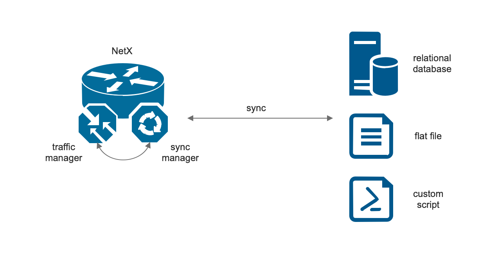

# Traffic shaping

NetX platform offers comprehensive set of functions for managing QoS rules, perform traffic shaping, policing or marking. The main service 
responsible for managing QoS rules is traffic manager. Traffic manager has two major roles:

1. Takes care about loading shaping rules from external or internal sources and based on this information 
   orchestrate NetX platform to perform the necessary action. 
2. Marks packets passing through NetX router. Every packet can be marked with a tag. The mark tag can be referenced later in firewall, 
   traffic redirection or used during routing decisions. 

Traffic manager is designed to handle tens of thousands of records. It is possible to create separate shaping queues with own shaping 
parameters, organize shaping queues into hierarchical structure and much more. To get all necessary metadata (shaping and policing rules),
the traffic manager can poll directly an ISP's database as shown in the following figure.


If there is a need for data preprocessing, it is possible to use traffic manager together with a sync manager. In this scenario, the sync manager 
handles the communication with an external data source, does data preprocessing and stores the data to NetX internal database. Traffic manager then 
uses the local copy of the metadata and orchestrate the NetX platform accordingly as shown in the following picture. 



## Basic configuration

The following configuration describes the scenario where traffic manager is directly connected to an external source. The external source
is MySQL server with a shaping database. 

1. Connect to the NetX appliance, enter traffic-manager context:

```
netx# traffic-manager 
netx(traff-mgr)# 
```

2. Configure an interface where traffic manager will perform traffic shaping:

```
netx(traff-mgr)# interface bond0 
netx(traff-mgr)# interface ve3
```

3. Configure connection parameters to SQL server:

```
netx(traff-mgr)# db-driver mysql 
netx(traff-mgr)# db-dbname test
netx(traff-mgr)# db-host 192.0.2.10
netx(traff-mgr)# db-username netxmgmr
netx(traff-mgr)# db-password <secret password> 
```

4. Prepare and attach an SQL query that download the necessary metadata from the SQL server. If the SQL server uses the 
standard [database schema](traffic-shaping.md#database-schema), the following query could be used:

```
netx(traff-mgr)# shell
[root@netx admin]# cat > /etc/netc/sql/qos-basic.sql << EOF
# cat qos-basic.sql
SELECT 
	ipaddr, grp, download, upload, mark, parent 
FROM 
	shaping 
WHERE 
	active = 1
EOF
```

```
netx(traff-mgr)# db-qos-query qos-basic.sql
```
> [!NOTE]
> Without the path, the `netc` look for the file in `/etc/netc/sql/` directory. If the SQL query is stored in a different location, it's possible
> to add the location's path, e.g. `/home/admin/shaping/qos-basic.sql`

5. Review the configuration:

```
netx(traff-mgr)# show this 
  db-dbname test
  db-driver mysql
  db-host 192.0.2.10
  db-qos-query qos-basic.sql
  db-scan-interval 60
  db-username netxmgmr
  interface ve3
  interface bond0
```

6. Show internal status of traffic manager:

```
netx(traff-mgr)# show config 
DB Driver Name                : mysql
DB Name                       : test
DB User Name                  : netxmgmr
Scan Time (secs)              : 60
QoS Scan Query File           : qos-basic.sql
Query Error Status            : OK
Query Execution Time (secs)   : 0.249039173126221
Query Returned Records        : 7970
Installed QoS Rules           : 7970
Last updated                  : 2019-06-03 12:57:26 (26.93 secs ago)
Traffic manager status        : IDLE
Interfaces                    : ve3,bond0
```

The output of the `show config` command displays that NetX successfully connected to the SQL server (`Query Error Status` is OK), the SQL query returned 
7970 records (`Query Returned Records` is 7970). All those records have been successfully installed (`Installed QoS Rules` is 7970).


## Display QoS information

It is possible to display information about all configured QoS groups, together with actual traffic for each group using `show qos-rules` in 
traffic-manager context.

```
netx(traff-mgr)# show qos-rules 
GROUP                    DOWNLOAD                    UPLOAD
                      p/s        b/s             p/s        b/s
usr-pus0025           0.3      491.2             0.0        0.0 
usr-lul0084          20.8      235.2k            0.0       40.8 
usr-pros0015          2.9        3.2k            3.7       23.7k
usr-rac0018         861.4        5.0M          322.6      185.7k
...
```

Detailed information about the group can be displayed using the `show qos-rules group <group-name>`. E.g. the following command show detailed 
information about the usr `usr-rac0018`.

```
netx# show traffic-manager qos-rules group usr-rac0018
Group:                usr-rac0018
IP(s):                10.4.8.11
Interfaces:           bond0
Download:             11.3M
Upload:                2.3M
Mark:                 1

                         DOWNLOAD                     UPLOAD
                      total     per/sec          total     per/sec
Bytes,bits/s          29.7G     145.3k            2.8G      21.9k
pkts                  46.8M      47.7            35.0M      46.7 
dropped                0.0        0.0             0.0        0.0 
overlimits             0.0        0.0             0.0        0.0 
requeues               0.0        0.0             0.0        0.0 
```

It is possible to watch the traffic in real time, using the `monitor` command. E.g. the following command will refresh terminal screen every seconds
with current information. Pressing `Q` will quit the screen and return to the `netc` shell. Keys `+` or `-` can be used to adjust the refreshing 
interval.

```
netx# monitor traffic-manager qos-rules group usr-rac0018

 15:35:05   delay: 1 s
----------------------------------------------------------------------
Group:                usr-rac0018
IP(s):                10.4.8.11
Interfaces:           bond0
Download:             11.3M
Upload:                2.3M
Mark:                 1

                         DOWNLOAD                     UPLOAD
                      total     per/sec          total     per/sec
Bytes,bits/s          29.8G     129.6k            2.8G      18.7k
pkts                  46.9M      42.7            35.1M      41.2
dropped                0.0        0.0             0.0        0.0
overlimits             0.0        0.0             0.0        0.0
requeues               0.0        0.0             0.0        0.0
----------------------------------------------------------------------
 Q: quit   <space>: refresh   +,-: delay
```

## Sync manager configuration

The synchronisation manager handles cases where there is a need for data preprocessing. The perfect use case for sync manager is synchronisation with
3rd party management softwares such as [ISPadmin](https://ispadmin.eu) or [Mango](https://www.ogsoft.cz/produkty-a-sluzby/pro-isp/mango-isp). It is 
possible to use flat files or custom scripts as well. Sync manager configuration is very similar to traffic manager. In the following example, sync
manager is connected to ISPadmin to download all shaping rules.

```
netx# sync-manager 
netx(sync-mgr)# data-source ispadmin
netx(sync-mgr)# db-host 10.100.170.6
netx(sync-mgr)# db-password sGX8fJu7T
netx(sync-mgr)# db-username netx
netx(sync-mgr)# enable
```

## Database schema

The traffic manager uses the following database schema for basic shaping/policing and marking.

```
--
-- Table structure for table `shaping`
--

CREATE TABLE shaping (
  id int(11) NOT NULL AUTO_INCREMENT,
  ipaddr varchar(128) NOT NULL,
  grp varchar(128) NOT NULL,
  download int(11) NOT NULL,
  upload int(11) NOT NULL,
  mark varchar(128) NOT NULL,
  parent varchar(128) NOT NULL,
  active int(11) NOT NULL,
  PRIMARY KEY (`id`)
);
```

The meaning of the columns is the following:
* `ipaddr` : IPv4 or IPv6 address in text format. IP address can be extended with a mask length (IP prefix). If the prefix syntax is
used, the shaping rule is applied for the whole prefix. Examples of the values in the column: `192.0.2.2`, `192.0.2.16/28`, 
`2001:db8:1220::/48`. The `NULL` value is allowed only if the column `grp` is defined.
* `grp` : A unique group for every shaping rule. Groups can be used in the hierarchical shaping or can merge multiple shaping rules 
(for example IPv4 and IPv6 prefixes) into a one shaping queue. `NULL` value is allowed. If the `NULL` value is set, the group is 
internally created based on the `ipaddr` column as `grp-<ipaddr>`.
* `download` : Allowed bandwidth in bits per second (Example: 10000000 = 10Mb/s)
* `upload` : The same as `download` but for the upload direction.
* `mark` :  Every packet entering into NetX router can be marked by a value. This mark can be later used in firewall rules, etc. `NULL` 
value is transformed to 0.
* `parent` : Name of the superior group. This column is used when hierarchical traffic shaping is required.
* `active` : A flag which defines whether record will be used by traffic manager or not.  
 
## Database rules examples

The [database schema](traffic-shaping.md#database-schema) shows basic database table that can be used by traffic manager. This section shows basic 
examples how to use all those fields.

* Shaping an address: The following record achieve that IP address 192.0.2.5 is allowed to download 10 Mb/s. Upload speed is set to 5 Mb/s. No marking
or hieararchical shaping is used.

```
IP				          GRP     DOWNLOAD  UPLOAD   MARK  PARENT
192.0.2.5                 NULL    10000000  5000000  NULL  NULL
```

* Shaping a prefix: It's possible to shape a whole prefix (either IPv4 or IPv6). E.g.

```
IP				          GRP     DOWNLOAD  UPLOAD   MARK  PARENT
2001:db8:1220:a::/64      NULL    10000000  5000000  NULL  NULL
```

* Shaping IPv4 + IPv6: If dual stacked is provided to a client, it's possible to shape the client regardless of a protocol. Group column is used for 
grouping all IP addresses (IPv4 or IPv6) to one group. In the following example, two groups (`user1` and `user2`) are created. All IP addresses in the
particular group will have togeteher 10 Mb/s download and 5 Mb/s upload.

```
IP				          GRP     DOWNLOAD  UPLOAD   MARK  PARENT
192.0.2.5                 user1   10000000  5000000  NULL  NULL
2001:67c:1220:a::/64      user1   10000000  5000000  NULL  NULL
192.0.2.6                 user2   10000000  5000000  NULL  NULL
2001:67c:1220:b::/64      user2   10000000  5000000  NULL  NULL
```

