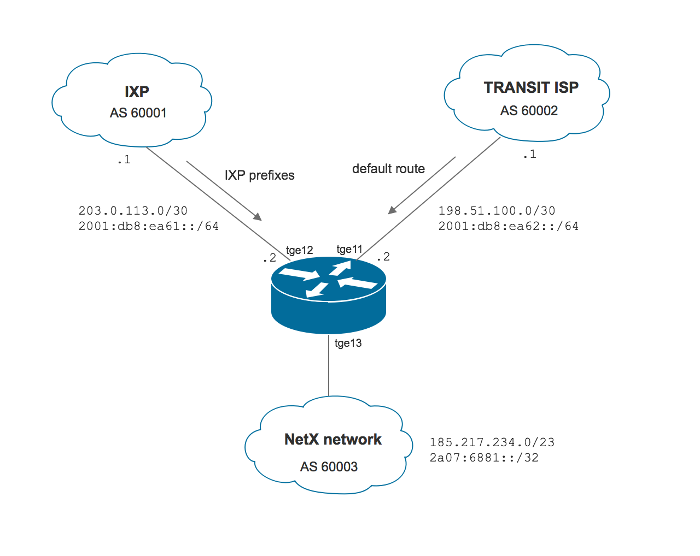

# BGP routing example

This example shows a simple configuration that connects NetX router to two BGP peers. One peer is a transit provider; the second 
peer is an exchange point. In the example, only the default route from the upstream peer is accepted. All available routes are accepted 
from the IXP peer. Single IPv4 and IPv6 prefixes are announced to both upstream and IXP. The topology is shown in the following section.

## Topology


## Address plan

NetX router uses the following interfaces and addresses:

* Transit provider: interface `tge11`, 198.51.100.2/30, 2001:db8:ea62::2/64
* IXP: interface `tge12`, 203.0.113.2/30, 2001:db8:ea61::2/64
* NetX internal network: we will export 185.217.234.0/23 and 2a07:6881::/32 routes to the BGP

The following commands can be used to set up IP addresses:

```
! set up tge11 addresses
netx# interface tge11 ipv4 address 198.51.100.2/30
netx# interface tge11 ipv6 address 2001:db8:ea62::2/64

! set up tge12 addresses
netx# interface tge12 ipv4 address 203.0.113.2/30
netx# interface tge12 ipv6 address 2001:db8:ea61::2/64
```

## BIRD config

* At the first step, a basic BIRD config is created. 

```
netx# router bird config-file bird.conf
No config file found. Building an initial config file in /etc/netc/bird/bird.conf
Starting bird
```

* We can edit the default config template by using the following command.

```
netx# router bird config-file bird.conf edit
```

``` 
# Example bird config file

log "/var/log/bird.log" all;
log syslog { info, remote, warning, error, auth, fatal, bug };

# set router id 
router id 203.0.113.2;

protocol device DEVICE { }
protocol direct DIRECT { ipv4; ipv6; }
protocol kernel KERNEL4 { ipv4 { export all; }; }
protocol kernel KERNEL6 { ipv6 { export all; }; }

# see documentation on https://docs.netx.as for more exaples
```

> [!NOTE]
> `route id` is set automatically to the highest IPv4 address. You have to set it manually if you run IPv6 only network.

The config template defined logging options and four essential protocols. DEVICE and DIRECT protocols provide access to locally configured interfaces 
for both IPv4 and IPv6 protocols. KERNEL4 and KERNEL6 protocols define interfaces between internal BIRD routing structures and kernel’s IPv4 and IPv6 FIBs. 
We usually export all routes from internal BIRD routing table to kernel’s table. The kernel protocols must be defined separately for IPv4 and IPv6.

* As we don't want to import all internal networks to the BGP, we change KERNEL4 and KERNEL6 definitions and disable import. 

```
protocol kernel KERNEL4 { ipv4 { export all; import none; }; }

protocol kernel KERNEL6 { ipv6 { export all; import none; }; }
```

* Let's create static blackholed routes that will be propagated via BGP to our peers.  

```
protocol static STATIC4 {
    ipv4 { preference 110; };
    route 185.217.234.0/23 blackhole;
}

protocol static STATIC6 {
    ipv6 { preference 110; };
    route 2a07:6881::/32 blackhole;
}
```

* It's recommended to create templates to make the configuration clearer. A template doesn't represent any protocol, but it can be used later in protocol 
definition. The template can contain definitions for both IPv4 and IPv6 protocols (channels). 

```
template bgp T_UPSTREAM {
    local as 60003;

    ipv4 {
        import filter {
            if ( net ~ [ 0.0.0.0/0 ] ) then accept;
            reject;
        };
        export filter {
            if ( net ~ [ 185.217.234.0/23 ] ) then accept;
            reject;
        };
    };

    ipv6 {
        import filter {
            if ( net ~ [ 0::/0 ] ) then accept;
            reject;
        };
        export filter {
            if ( net ~ [ 2a07:6881::/32 ] ) then accept;
            reject;
        };
    };

}
```

The template defines import and export filters. Import filters are simple - only IPv4/IPv6 default routes are accepted from the upstream provider. These 
default routes will be installed in FIBs after the BGP sessions are established. The export filter defines which routes will be sent to an upstream provider. 
In the example, we announce one IPv4 /23 and one /32 IPv6 route that we created in the previous step via static protocols.

* After setting up protocols and a template, we can establish BGP sessions towards upstream routers. The following config establishes IPv4/IPv6 sessions 
to the upstream provider. Sessions are named UPS4 and UPS6.

```
protocol bgp UPS4 from T_UPSTREAM { neighbor 198.51.100.1 as 60002; }
protocol bgp UPS6 from T_UPSTREAM { neighbor 2001:db8:ea62::1 as 60002; }
```

* Another IPv4/IPv6 BGP sessions are established towards IXP route server. Only routes from route server are accepted. This is done by 
overriding template import filter in the protocol definition. The following config sets up sessions and overrides import filters by adding 
`ipv4 { import all; }` or `ipv6 { import all; }` to the protocol definition.

```
protocol bgp IXP4 from T_UPSTREAM { 
	neighbor 203.0.113.1 as 60001; 
	ipv4 { import all; } 
}

protocol bgp IXP6 from T_UPSTREAM { 
	neighbor 2001:db8:ea61::1 as 60001; 
	ipv6 { import all; } 
}
```

## Display info

It's possible to check status of BIRD by issuing `show protocols` in `router bird` context. E.g.:

```
netx(router-bird)# show protocols 
Name       Proto      Table      State  Since         Info
device1    Device     ---        up     2018-06-20    
DIRECT     Direct     ---        up     2018-06-20    
KERNEL4    Kernel     master4    up     2018-06-20    
KERNEL6    Kernel     master6    up     2018-06-20    
STATIC4    Static     master4    up     2018-06-20    
STATIC6    Static     master6    up     2018-06-20    
UPS4       BGP        ---        up     2018-06-20    Established   
UPS6       BGP        ---        up     2018-06-20    Established   
IXP4       BGP        ---        up     2018-06-20    Established   
IXP6       BGP        ---        up     2018-06-20    Established   
```

More detailed information related to each protocol can be obtained by `show protocols` command extended with a protocol name.

```
netx(router-bird)# show protocols IXP4
Name       Proto      Table      State  Since         Info
IXP4       BGP        ---        up     2018-06-20    Established   
  BGP state:          Established
    Neighbor address: 203.0.113.1
    Neighbor AS:      60001
    Neighbor ID:      203.0.113.1
    Local capabilities
      Multiprotocol
        AF announced: ipv4 ipv6
      Route refresh
      Graceful restart
      4-octet AS numbers
      Enhanced refresh
    Neighbor capabilities
      Multiprotocol
        AF announced: ipv4
      Route refresh
      Graceful restart
      4-octet AS numbers
    Session:          external AS4
    Source address:   203.0.113.2
    Hold timer:       184.767/240
    Keepalive timer:  29.445/80
  Channel ipv4
    State:          UP
    Table:          master4
    Preference:     100
    Input filter:   (unnamed)
    Output filter:  (unnamed)
------ Q: quit   A: print all   <space> : continue -------
```

Details about IPv4/IPv6 routes can be displayed by switching to the BIRD cli and using BIRD internal show commands, e.g.:

```
netx# birdc
BIRD 2.0.2 ready.
bird> show route protocol IXP4
Table master4:
40.0.0.0/10          unicast [IXP4 2018-08-31 from 203.0.113.1] * (100) [AS4249i]
	via 203.0.113.2 on tge12
76.0.0.0/19          unicast [IXP4 2018-08-29 from 203.0.113.1] * (100) [AS18494i]
	via 203.0.113.2 on tge12
32.0.0.0/8           unicast [IXP4 2018-09-13 from 203.0.113.1] * (100) [AS2686i]
	via 203.0.113.2 on tge12

<snip> 
```
