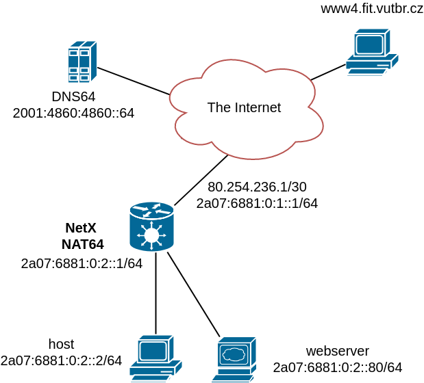

# NAT64 example

This example shows a simple configuration that connects IPv6 only network with the rest of the Internet. 
IPv4 only hosts are still reachable through NAT64 AFTR running on NetX router. 

Whenever an IPv6 host wants to contact a host on the Internet, it asks DNS64 for address translation. If the DNS64 server detects that the requested service does not have a matching AAAA record, the response is created by concatenation of NAT64 prefix and queried host IPv4 address. All hosts now seem to have IPv6 connectivity. The used DNS64 server in this example is [public Google DNS64 server](https://developers.google.com/speed/public-dns/docs/dns64) 2001:4860:4860::64.

> [!NOTE]
> DNS resolution must take place before work with IP literals. Some applications with hard-coded IPv4 literal could have problems.


There is also a static record in the BIB table so that a web server inside the internal IPv6 only network is also available for external IPv4 only clients.


## Topology


## Address plan

NetX router uses the following interfaces and addresses:

* Internet connectivity: interface `ge1`, 80.254.236.1/30 2a07:6881:0:1::1/64
* Local IPv6 only network: interface `tge3`, 2a07:6881:0:2::1/64
* NAT64 prefix: 64:ff9b::/96
* IPv4 pool: 80.254.236.128/25
* P2P subnets for NAT64 virtual namespace: 80.254.236.4/30 2a07:6881:0:64::/64

The following commands can be used to set up IP addresses:

```
! set up ge1 addresses
netx# interface ge1 ipv4 address 80.254.236.1/30
netx# interface ge1 ipv6 address 2a07:6881:0:1::1/64
netx# ipv4 route 0.0.0.0/0 80.254.236.2
netx# ipv6 route ::/0 2a07:6881:0:1::2

! set up tge3 addresses
netx# interface tge3 ipv6 address 2a07:6881:0:2::1/64
```

## Host config (Linux)

```
host# ip addr add 2a07:6881:0:2::2/64 dev eno1
host# ip route add ::/0 2a07:6881:0:2::1
host# cat "nameserver 2001:4860:4860::64" > /etc/resolv.conf
```

Basic address, default route and DNS server assignment.

## Webserver config (Linux)

```
host# ip addr add 2a07:6881:0:2::80/64 dev eno1
host# ip route add ::/0 2a07:6881:0:2::1
host# cat "nameserver 2001:4860:4860::64" > /etc/resolv.conf
```

Basic address, default route and DNS server assignment.

## NetX NAT64 config

* NAT64 instance creation. 

```
netx# ipv6 nat64 instance 64:ff9b::/96 2a07:6881:0:64::0/64 80.254.236.4/30
```

* IPv4 pool adding. 

```
netx# ipv6 nat64 pool4 80.254.236.128/25
```
> [!NOTE]
> The pool4 subnet has to be properly routed towards the NetX router. 

* Static BIB record for webserver adding.

```
netx# ipv6 nat64 bib 80.254.236.129:80 2a07:6881:0:2::80.80
```

Webserver is now reachable via 80.254.236.129.

## Verification

* Instance verification

```
netx# show ipv6 nat64 
Stateful NAT64 instance is runnig
Is enabled: Yes
NAT64 prefix: 64:ff9b::/96
Pool4: 80.254.236.128/25
Pool4 route inserted: Yes
Pool4 Jools IPv4 counts: TCP 128, UDP 128, ICMP 128
BIB Jools entry counts: TCP 1, UDP 1, ICMP 1
```

* DNS64 verification

```
host# dig AAAA +noall +answer www4.fit.vutbr.cz
www4.fit.vutbr.cz.  14399 IN  CNAME tereza.fit.vutbr.cz.
tereza.fit.vutbr.cz.  14399 IN  AAAA  64:ff9b::93e5:916
```

* traceroute6 verification

```
host# traceroute6 www4.fit.vutbr.cz
traceroute to www4.fit.vutbr.cz (64:ff9b::93e5:916), 30 hops max, 80 byte packets
 1  2a07:6881:0:1::1 (2a07:6881:0:1::1)  0.175 ms  0.163 ms  0.152 ms
 2  2a07:6881:0:64::2 (2a07:6881:0:64::2)  0.336 ms  0.339 ms  0.280 ms
 3  64:ff9b::50fe:ec05 (64:ff9b::50fe:ec05)  0.265 ms  0.269 ms  0.252 ms
 4  64:ff9b::50fe:ec01 (64:ff9b::50fe:ec01)  0.431 ms  0.423 ms  0.415 ms
 5  64:ff9b::b901:1904 (64:ff9b::b901:1904)  0.380 ms  0.351 ms  0.339 ms
 6  64:ff9b::93e5:fc71 (64:ff9b::93e5:fc71)  1.993 ms  2.583 ms  1.342 ms
 7  64:ff9b::93e5:fd35 (64:ff9b::93e5:fd35)  0.777 ms  1.141 ms  1.327 ms
 8  64:ff9b::93e5:fd38 (64:ff9b::93e5:fd38)  0.799 ms  0.812 ms  0.691 ms
 9  64:ff9b::93e5:fd3b (64:ff9b::93e5:fd3b)  2.993 ms 64:ff9b::93e5:fcc5 (64:ff9b::93e5:fcc5)  2.330 ms 64:ff9b::93e5:fd3b (64:ff9b::93e5:fd3b)  1.455 ms
 10  64:ff9b::93e5:feda (64:ff9b::93e5:feda)  9.291 ms  9.316 ms  9.445 ms
 11  64:ff9b::93e5:916 (64:ff9b::93e5:916)  0.546 ms  0.510 ms  0.513 ms
```

1 Local network gataway

2 Jool network namespace interface

3 Regular network namespace interface (64:ff9b::80.254.236.5)

4 Internet network gateway (64:ff9b::80.254.236.1)

...


* BIB and session verification

```
host# wget www4.fit.vutbr.cz

netx# show ipv6 nat64 bib
[Static TCP] 80.254.236.129#80 - 2a07:6881:0:2::80#80
[Dynamic TCP] 80.254.236.129#62916 - 2a07:6881:0:2::2#54228
[Static UDP] 80.254.236.129#80 - 2a07:6881:0:2::80#80
[Static ICMP] 80.254.236.129#80 - 2a07:6881:0:2::80#80
[Dynamic ICMP] 80.254.236.191#60559 - 2001:db8:111::2#14787

rt-netx-d# show ipv6 nat64 session 
TCP
---------------------------------
UDP
---------------------------------
ICMP
---------------------------------
rt-netx-d# show ipv6 nat64 session 
TCP
---------------------------------
(V4_FIN_V6_FIN_RCV) Expires in 00:01:40.949
Remote: tereza.fit.vutbr.cz#http        2a07:6881:0:2::2#54228
Local: 80.254.236.129#62916       64:ff9b::93e5:916#80
---------------------------------
UDP
---------------------------------
ICMP
---------------------------------
Expires in 00:00:59.494
Remote: 147.229.9.22#536702001:db8:111::2#15786
Local: 80.254.236.188#5367064:ff9b::93e5:916#15786
---------------------------------

```