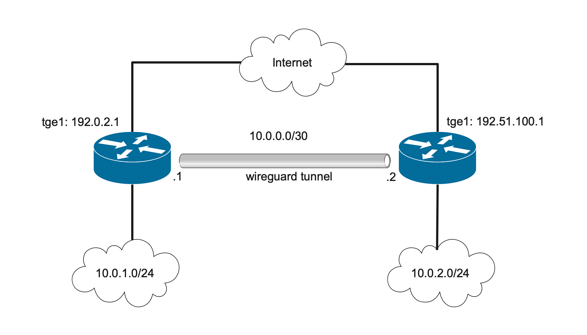

# WireGuard site-to-site example

This example shows a simple configuration that connects NetX routers via WireGuard tunnel. 

## Topology


## Address plan

NetX routers use the following interfaces and addresses:

* rt-netx-a: interface `tge1`, WAN interface, 192.0.2.1/24
* rt-netx-a: interface `wg0`, WireGuard interface, 10.0.0.1/30
* rt-netx-b: interface `tge1`, WAN interface, 192.51.100.1/24
* rt-netx-b: interface `wg0`, WireGuard interface, 10.0.0.2/30

As the first step, WAN interfaces are configured on both rt-netx-a and rt-netx-b.

```
! set up tge1 addresses on rt-netx-a
rt-netx-a# interface tge1 ipv4 address 192.0.2.1/24

! set up tge1 addresses on rt-netx-b
rt-netx-b# interface tge1 ipv4 address 192.51.100.1/24
```


## WireGuard config

* Creating WireGuard interface can be done using `interface wg0` command. This command creates WireGuard interface and
generates private/public key-pair. The following config creates WireGuard interfaces on both routes `rt-netx-a` and `rt-netx-b`,
diplays their public-keys and sets-up IPv4 address.

```
rt-netx-a# interface wg0
rt-netx-a(if-wg0)# ipv4 address 10.0.0.1/30
rt-netx-a(if-wg0)# show public-key
ChfUFxmTe76HqX4pAaDSaXqh/Bgi7w5qc5GGqVRKnlI=
```

```
rt-netx-b# interface wg0
rt-netx-b(if-wg0)# ipv4 address 10.0.0.2/30
rt-netx-b(if-wg0)# show public-key
ukhouOiMAMwpVqCFITVjifatTlwhYgmQm3am0zvL11E=
```

* As the next step, it's neccessary to configure a peer on both routers.

```
! The following command switch to interactive mode, where a peer can be defined
rt-netx-a(if-wg0)# peer
```

* The `[Interface]` section is created automatically. The peer section configure rt-netx-b as a WireGuard peer.
Syntax for the configuration file is the same as WireGuard [config file](https://man7.org/linux/man-pages/man8/wg.8.html#CONFIGURATION_FILE_FORMAT).

```
[Interface]
ListenPort = 51820
PrivateKey = MOqXAXUo1veELBOYSNtUSv4p6UGhMDde97....

[Peer]
PublicKey = ukhouOiMAMwpVqCFITVjifatTlwhYgmQm3am0zvL11E=
Endpoint = 192.51.100.1:51820
AllowedIPs = 10.0.2.0/24
```

* The same step is done on rt-netx-b with rt-netx-a's public key.

```
rt-netx-b(if-wg0)# peer

[Interface]
ListenPort = 51820
PrivateKey = cMhAKREuLz9RkDr6nJPlNcWfiVuV.....

[Peer]
PublicKey = ChfUFxmTe76HqX4pAaDSaXqh/Bgi7w5qc5GGqVRKnlI=
Endpoint = 192.0.2.1:51820
AllowedIPs = 10.0.1.0/24
```

* Enable wg0 interfaces both on rt-netx-a, and rt-netx-b.

```
rt-netx-a(if-wg0) no shutdown

! The same is done on rt-netx-b
rt-netx-b(if-wg0) no shutdown
```

* It's necessary to also set-up proper routing between subnets (if dynamic routing protocol is not in used)

```
! Let's create a static route on rt-netx-a pointing to rt-netx-b's subnet
rt-netx-a# ipv4 route 10.0.2.0/24 10.0.0.2

! The same is done on rt-netx-b, static route points to rt-netx-a's subnet
rt-netx-b# ipv4 route 10.0.1.0/24 10.0.0.1
```

> [!NOTE]
> Standard Linux WireGuard installation configure appropriate routes using `wg-quick` tool. NetX uses a different
> approach as it's up to an administrator to configre routing according his/her needs.

* `show peer` command can be used to display the status of the WireGuard tunnel. The following output
shows the status of the WireGuard tunnel on rt-netx-a.

```
rt-netx-a(if-wg0)# show peer 
peer: ukhouOiMAMwpVqCFITVjifatTlwhYgmQm3am0zvL11E=
  endpoint: 192.51.100.1:51820
  allowed ips: 10.0.2.0/24
  latest handshake: 1 hour, 46 minutes, 13 seconds ago
  transfer: 1.62 KiB received, 2.54 KiB sent
```

* The ping command can be used to verify the end-to-end reachability.

```
rt-netx-a(if-wg0) ping source 10.0.1.1 10.0.2.1
ping -c 3 -I 10.0.1.1 10.0.2.1
PING 10.0.2.1 (10.0.2.1) from 10.0.1.1 : 56(84) bytes of data.
64 bytes from 10.0.2.1: icmp_seq=1 ttl=64 time=0.515 ms
64 bytes from 10.0.2.1: icmp_seq=2 ttl=64 time=0.974 ms
64 bytes from 10.0.2.1: icmp_seq=3 ttl=64 time=1.09 ms

--- 10.0.2.1 ping statistics ---
3 packets transmitted, 3 received, 0% packet loss, time 2033ms
rtt min/avg/max/mdev = 0.515/0.859/1.090/0.250 ms
```

> [!NOTE]
> The `ping` command uses `source` option to select source IPv4 address. Without the source option,
> NetX selects the best address for outgoing ICMP request, which is IPv4 address of the WireGuard interface (`10.0.0.1`).
> This address, is however, not included in `AllowedIPs`, thus traffic is dropped.
